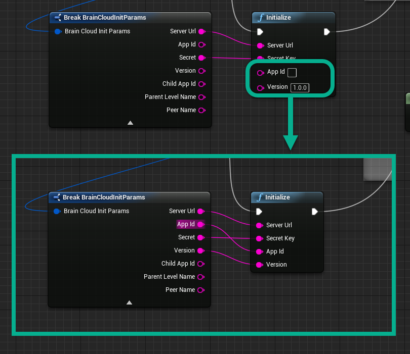

# brainCloud Unreal Plugin
Copyright 2021 bitHeads, Inc. All Rights Reserved.

Thanks for downloading the brainCloud Unreal plugin! Here are a few notes to get you started. Further information about the brainCloud API, including example Tutorials can be found here:

http://getbraincloud.com/apidocs/

If you haven't signed up or you want to log into the brainCloud portal, you can do that here:

https://portal.braincloudservers.com/

Package | Description
 ---- | ----
[**brainCloudClient_Unreal_vX.X.X_X.X.X.zip**](https://github.com/getbraincloud/braincloud-unreal/releases) | C++, Blueprint, and OnlineSubSystem library for Unreal 4 (stable zip)
[**braincloud-unreal-plugin-src**](https://github.com/getbraincloud/braincloud-unreal-plugin-src/) | C++, Blueprint, and OnlineSubSystem library for Unreal 4 (source)
[**Unreal - Older Versions**](http://getbraincloud.com/apidocs/tutorials/unreal-tutorials/building-the-plugin-for-older-versions-of-unreal/) | Instructions for building brainCloud for older versions of Unreal (for Blueprint only projects)

## Installation
1.  Open your Unreal Project's root folder (where the *.uproject file is)
2.  Open the Plugins folder, or create it if it does not exist
3.  Copy the BCClient folder into the Plugins folder
4.  If your project is NOT Blueprint only, be sure to regenerate your code project files
5.  Navigate to Edit -> Plugins
6.  Search for braincloud and enable plugin
7.  Restart Unreal Editor
8.  A dialog will pop up saying you're missing 3 modules, click yes to rebuild.
9.  Or, rebuild manually by deleting Intermediate folder, Binaries folder and .sln file 
then right click on your .uproject and generate visual studio files.
10.  Installation complete!

### Git Submodule Installation
BCClient plugin can be installed as a submodule of your git project.
Open a terminal at your project's root folder and enter the command:

$ git submodule add https://github.com/getbraincloud/braincloud-unreal-plugin-src.git Plugins/BCClient

Follow steps 4-10 above.

### Unreal Engine 5.0

The plugin will easily work with both UE4 and UE5. If switching, ensure that Intermediate files are cleaned up from previous build.

## Example Projects

Examples of using brainCloud in your Unreal Projects can be found [here](https://github.com/getbraincloud/examples-unreal).

## Notes
To manipulate JSON in Blueprint another plugin is required.
We recommend VaRest, which you can find in Epic Games Marketplace or here: https://github.com/ufna/VaRest

When methods are deprecated and removed Unreal will throw exceptions when opening 
Blueprints that contain these functions.

Ensure you have removed these functions from your blueprints before updating to the new
version of the plugin.  If you experience issues, roll back to to the previous version and
ensure you have not missed removal of these deprecated calls.

Note there is a defect that UTCTimeZoneOffset will be off for one hour in case of daylight savings due to limitations of UE Core API regarding DateTime.

## Troubleshooting

Here are a few common errors that you may see on your first attempt to connect to brainCloud.

- **App id not set**: Verify you've set up the app id and app secret correctly in the `initialize()` method.
- **Platform not enabled**: Verify you've enabled your platform on the portal.

If you're still having issues, log into the portal and give us a shout through the help system (bottom right icon with the question mark and chat bubble).

## brainCloud Summary

brainCloud is a ready-made back-end platform for the development of feature-rich games, apps and things. brainCloud provides the features you need – along with comprehensive tools to support your team during development, testing and user support.

brainCloud consists of:
- Cloud Service – an advanced, Software-as-a-Service (SaaS) back-end
- Client Libraries – local client libraries (SDKs)
- Design Portal – a portal that allows you to design and debug your apps
- brainCloud Architecture

## What's the difference between the brainCloud Wrapper and the brainCloud Client?
The wrapper contains quality of life improvement around the brainCloud Client. It may contain device specific code, such as serializing the user's login id on an Android or iOS device.
It is recommended to use the wrapper by default.

## How do I initialize brainCloud?

1. Create a BrainCloudWrapper - This will store an instance of brainCloud and give you a way of accessing the services we provide.

2. Store and set the wrapper - You will want a variable of type BrainCloudWrapper.

3. Set the Default brainCloud instance to your wrapper - this allows Singleton functionality, and you won't need to pass the wrapper into each function call, unless needed.

4. Initialize brainCloud with your app credentials 

Your Secret Key, and App Id, is set on the brainCloud dashboard. Under Design | Core App Info > Application IDs

Wrapper Name prefixes save operations that the wrapper will make. Use a Wrapper Name if you plan on having multiple instances of brainCloud running.

----------------

#### Newly upgraded?
If your app is already live, you should **NOT** specify the Wrapper Name - otherwise the library will look in the wrong location for your user's stored anonymousID and profileID information. Only add a name if you intend to alter the save data.

---------------

Version is the current version of our app. Having an Version less than your minimum app version on brainCloud will prevent the user from accessing the service until they update their app to the lastest version you have provided them.

## How do I keep the brainCloud SDK updating?
In your project's update loop, you're going to want to update brainCloud client so it can check for responses.

To do this, you need to call Run Callbacks

## How do I authenticate a user with brainCloud?
The simplest form of authenticating with brainCloud is Anonymous Authentication.

## How do I attach an email to a user's brainCloud profile?
After having the user create an anonymous with brainCloud, they are probably going to want to attach an email or username, so their account can be accessed via another platform, or when their local data is discarded. Attaching email authenticate would look like this.

Attaching email authenticate would look like this.

There are many authentication types. You can also merge profiles and detach idenities. See the brainCloud documentation for more information:
http://getbraincloud.com/apidocs/apiref/?cpp#capi-auth

## Building for Android
For developers looking to build their project for Android, note that you can only package one architecture at a time (ex.ARM64, ARMv7, etc.)

## Change Notes
3.5.3
- toPlayerId in SendNormalizedPushNotificationToGroup blueprint has been corrected to groupId. Be sure to reenter/reconnect those values

3.4.0
- gameId and gameVersion have been renamed to appId and version respectively. Be sure to reenter/reconnect those values

